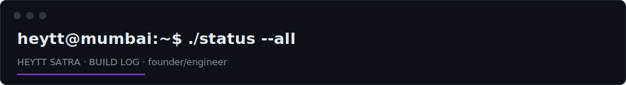

I build AI products that ship to paying clients and run a production house serving Mumbai's founder ecosystem. Final year B.Tech, Computer Science and Business Systems, NMIMS Mumbai.

```text
$ ./status --all

  ▲ kenmarkit-chatbot    production    RAG chatbot live for a paying client (kenmarkitan.com)
  ▲ production house     operating     crew, gear and delivery for founder podcasts and events
  ● profitpulse          building      AI CFO for SMBs: Stripe, Shopify, Meta Ads, Google Ads connected
  ◆ peerclub             shipped       invite-only founder community platform, entry by approval

  uptime: shipping for clients since 2024 · 6 client sites delivered · 2 upstream PRs merged
```

| Project | Proof | |
|:--------|:------|:--|
| **kenmarkIT Chatbot**, production RAG pipeline | Live for a real client. Transformers.js embeddings, MongoDB vector search, Groq inference, admin dashboard | [repo](https://github.com/heytt-satra/kenmarkIT-Chatbot-) |
| **ProfitPulse AI**, conversational AI CFO | Live integrations with Stripe, Shopify, Meta Ads and Google Ads. NL to SQL via Vanna.ai, Supabase auth | [repo](https://github.com/heytt-satra/ProfitPulse) |
| **Mars Rover Sign Detection**, autonomous navigation | YOLO + ZED2 depth on Jetson hardware. Team Kosmos, International Rover Challenge 2023-24 | [repo](https://github.com/heytt-satra/Sign-Detection-System-for-Mars-Rover-using-YOLO-and-ZED2-Camera) |
| **Grabit**, media tooling | Video downloader for X and Instagram with styled post screenshot cards | [repo](https://github.com/heytt-satra/Grabit-) |

```text
$ cat receipts.txt

  accenture       swe intern, dec 2025 to may 2026: enterprise APIs, AI agent automation
  crc press       co-authored book chapter on explainable AI (interactive UI for captum)
  vibecon india   round 2 from 3,000+ applicants, screened by YC and anthropic
  open source     numfocus/MOSS accessibility fix · f1-race-replay, 2 PRs merged
  team kosmos     founding member, 9th place debut at the international rover challenge
```

```text
$ cat stack.txt
typescript · python · java · next.js · react · node
mongodb · supabase · groq/llama · yolo/tensorflow · qiskit
```

<div align="center">


</div>

heyttsatra17@gmail.com · [GitHub](https://github.com/heytt-satra) · [LinkedIn](https://www.linkedin.com/in/heytt-satra) · [heyttsatra.dev](https://www.heyttsatra.dev) · [X](https://x.com/satra_heytt)

<div align="center">
<i>Ship the thing. The rest is commentary.</i>
</div>
